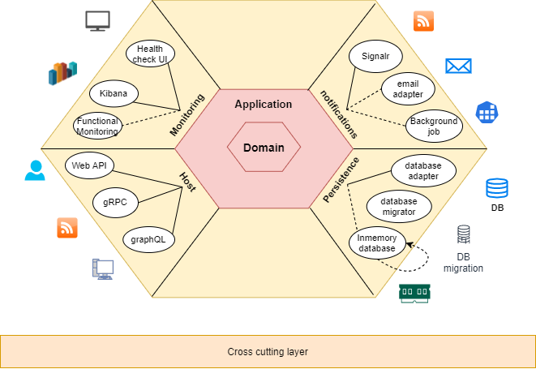

# Modular-Architecture-ASP.NET-Core

## Modular Architecture

Modular Architecture also sometime called as Modular Monilth Architecture 

## About The Project

Solution template which is built on Modular Architecture with all essential feature using .NET Core!
s

## Status

Untick mark is yet to complete soon

## Technology stack

* Architecture
    - [x] Hexagonal architecture
    - [x] Screaming architecture
* Design Pattern
    - [x] CQRS design pattern
    - [ ] Decorator design pattern
    - [x] Mediator design pattern
    - [x] Repository design pattern
    - [ ] Unit of work 
* Backend
    - [x] Language: C#
    - [x] Framework: dotnet core 3.1, ASP.NET Core
    - [ ] Framework: dotnet core 5, ASP.NET Core
* UI
    - [ ] Framework: React-Redux boiler plate
    - [ ] MVC Core
    - [ ] Blazor
* Database
    - [x] MS SQL and Inmemory DB
    - [x] DB Connectivity : Entityframework Core - Code First
* Cloud server
    - [ ] Azure  (alternate is AWS)
* Service
    - [x] Web API (Restful service)
    - [ ] gRPC
    - [x] Graphql
* Feature
    - [x] Dataseeding
    - [x] Custom Exceptionn Handler
    - [x] Automapper
    - [x] Fluent validation
    - [x] Serilog
    - [x] Swagger UI
    - [x] Healthcheck UI
    - [x] Advanced Pagination
    - [x] InMemory caching
    - [x] API Versioning
    - [ ] User Auditing
    - [ ] Mailkit (Mail service)
    - [ ] Hangfire
    - [x] Miniprofiler
    - [ ] Enabling CORS
* Authentication
    - [ ] Identity server 4
    - [ ] OAuth2
    - [ ] JWT Authentication
* Monitoring tool
    - [x] Health check UI
    - [x] Miniprofiler
    - [ ] Kibana dashboard (alternate is Grafana)
* Testing Strategy using the testing pyramid
    - [x] Unit testing (Nunit)        
    - [x] Integration testing
* CI/CD
    - [x] Task runner: .Net core and CircleCI
    - [x] Coverage report: Sonarcloud.io
    - [x] Quality report: Codacy
    - [ ] Docker image and Kubernate
    - [ ] Azure pipelins
* Documentation
    - [x] Conventional commit - commit and commit message    

## Give a Star! :star:

If you like or are using this project to learn or start your solution, please give it a star. Thanks!

## Support This Project

If you have found this project helpful, either as a library that you use or as a learning tool, please consider buying me a coffee:

## Licence Used

See the contents of the LICENSE file for details

## Contact

Having any issues or troubles getting started? Drop a mail to amit.naik8103@gmail.com or [Raise a Bug or Feature Request](https://github.com/Amitpnk/Clean-architecture-ASP.NET-Core/issues/new). Always happy to help.
